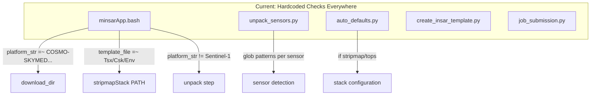
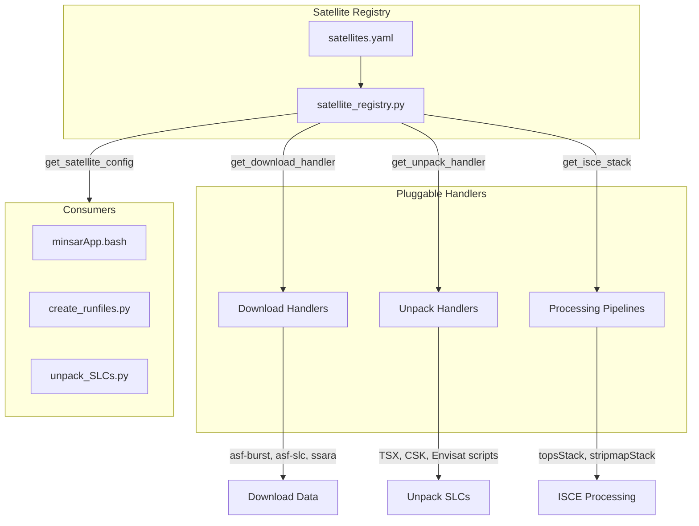

# MinSAR Modular Satellite Architecture Refactoring Plan

**Date:** January 31, 2026  
**Status:** Proposed  
**Overview:** Refactor minsar to use a centralized satellite registry with pluggable download, unpack, and processing handlers. This will make adding new satellites trivial and allow flexible configuration per satellite and per project.

---

## Todos

- [ ] **phase1-registry**: Create satellite_registry.py with SatelliteConfig dataclass and lookup functions
- [ ] **phase1-tests**: Add unit tests for satellite registry lookups
- [ ] **phase2-bash**: Create satellite_helpers.sh with load_satellite_config and helper functions
- [ ] **phase3-minsarapp**: Refactor minsarApp.bash to use satellite registry instead of hardcoded checks
- [ ] **phase4-unpack**: Refactor unpack_sensors.py to use registry for file patterns
- [ ] **phase4-autodefaults**: Refactor auto_defaults.py to use registry
- [ ] **phase4-createtemplate**: Refactor create_insar_template.py to use registry
- [ ] **phase5-docs**: Update architecture_docs with satellite registry documentation

---

## Current State: Scattered Hardcoded Logic

The satellite-specific behavior is spread across multiple files with regex/string matching:



**Key pain points in [minsarApp.bash](minsar/bin/minsarApp.bash):**

| Lines | Logic | Problem |
|-------|-------|---------|
| 414-419 | `grep platform` + fallback to TERRASAR-X | Detection scattered |
| 422-428 | `platform_str =~ COSMO-SKYMED\|TERRASAR-X\|ENVISAT` | Hardcoded list |
| 424 | Force `ssara-bash` if asf-burst for non-Sentinel | Implicit override |
| 480-482 | `platform_str != *"Sentinel-1"*` for unpack | Sentinel special-cased |
| 553 | `template_file == *"Sen"*` for orbit download | Filename-based detection |
| 562, 570 | `template_file =~ (Tsx\|Csk\|Env)` for stripmapStack | Template name parsing |

---

## Proposed Architecture: Satellite Registry + Handlers



---

## 1. Satellite Registry (`minsar/objects/satellite_registry.py`)

Central Python module defining all satellite configurations:

```python
# Each satellite has a complete configuration
SATELLITES = {
    "sentinel1": {
        "id": "sentinel1",
        "display_name": "Sentinel-1",
        "aliases": ["SENTINEL-1", "SENTINEL-1A", "SENTINEL-1B", "Sen", "S1"],
        "ssara_platform": "SENTINEL-1A,SENTINEL-1B",
        
        # Acquisition and processing
        "acquisition_mode": "tops",
        "isce_stack": "topsStack",
        "isce_steps": {"geometry": 11, "NESD": 16},
        
        # Download configuration
        "download_dir_name": "SLC",            # relative to WORK_DIR
        "default_download_method": "asf-burst",
        "supported_download_methods": ["asf-burst", "asf-slc", "ssara-bash", "ssara-python"],
        
        # Unpack configuration
        "needs_unpack": False,
        "unpack_handler": None,
        
        # Orbit handling
        "needs_orbit_download": True,
        "orbit_download_script": "run_download_orbits_asf.bash",
        
        # Template detection patterns (for filename-based detection)
        "template_patterns": ["Sen"],
        
        # File patterns for sensor detection (used by unpack_sensors.py)
        "file_patterns": [],
        
        # Other flags
        "use_buffered_output": False,
    },
    
    "terrasar_x": {
        "id": "terrasar_x",
        "display_name": "TerraSAR-X",
        "aliases": ["TERRASAR-X", "TSX", "Tsx", "TDX"],
        "ssara_platform": "TERRASAR-X",
        
        "acquisition_mode": "stripmap",
        "isce_stack": "stripmapStack",
        "isce_steps": {"default": 9},
        
        "download_dir_name": "SLC_ORIG",
        "default_download_method": "ssara-bash",
        "supported_download_methods": ["ssara-bash", "ssara-python", "remote_data_dir"],
        
        "needs_unpack": True,
        "unpack_handler": "unpackFrame_TSX",
        
        "needs_orbit_download": False,
        "orbit_download_script": None,
        
        "template_patterns": ["Tsx"],
        "file_patterns": ["dims_op*", "T*X1*"],
        
        "use_buffered_output": True,
    },
    
    "cosmo_skymed": {
        "id": "cosmo_skymed",
        "display_name": "COSMO-SkyMed",
        "aliases": ["COSMO-SKYMED", "CSK", "Csk", "COSMO-SKYMED-1", "COSMO-SKYMED-2", ...],
        # ... similar structure
    },
    
    "envisat": {
        "id": "envisat",
        "display_name": "Envisat",
        "aliases": ["ENVISAT", "ENV", "Env"],
        # ... similar structure
    },
    
    # Future satellites - just add entries here
    "alos2": { ... },
    "radarsat2": { ... },
}
```

**Key functions:**

```python
def get_satellite_config(identifier: str) -> SatelliteConfig:
    """Look up satellite by any alias, platform string, or template pattern."""

def get_satellite_from_template(template_file: str) -> SatelliteConfig:
    """Detect satellite from template file (ssaraopt.platform or filename)."""

def get_download_handler(satellite_id: str, method: str) -> DownloadHandler:
    """Get the appropriate download handler for a satellite and method."""

def validate_download_method(satellite_id: str, method: str) -> bool:
    """Check if a download method is supported for this satellite."""
```

---

## 2. Bash Integration (`minsar/lib/satellite_helpers.sh`)

Thin wrapper to call Python registry from bash:

```bash
# Source this in minsarApp.bash
source "${SCRIPT_DIR}/../lib/satellite_helpers.sh"

# Get satellite config as exported variables
load_satellite_config "$template_file"
# Now have: $SATELLITE_ID, $DOWNLOAD_DIR_NAME, $ISCE_STACK, 
#           $NEEDS_UNPACK, $NEEDS_ORBIT_DOWNLOAD, etc.

# Or query specific values
download_dir=$(get_satellite_property "$template_file" download_dir_name)
```

Implementation calls Python:

```bash
load_satellite_config() {
    local template_file="$1"
    eval "$(python3 -c "
from minsar.objects.satellite_registry import get_satellite_from_template, export_for_bash
config = get_satellite_from_template('$template_file')
print(export_for_bash(config))
")"
}
```

---

## 3. Refactored minsarApp.bash

**Before (current):**

```bash
platform_str=$( (grep platform "$template_file" || echo "") | cut -d'=' -f2 )
if [[ -z $platform_str ]]; then
   platform_str="TERRASAR-X"
fi

if [[ $platform_str =~ COSMO-SKYMED|TERRASAR-X|ENVISAT ]]; then
    download_dir="$WORK_DIR/SLC_ORIG"
    [[ $download_method == *asf-burst* ]] && download_method="ssara-bash"
else
    download_dir="$WORK_DIR/SLC"
fi
# ... 
if [[ $platform_str != *"Sentinel-1"* ]] && [[ $unpack_flag == "1" ]]; then
    run_command "unpack_SLCs.py $download_dir --queue $QUEUENAME"
fi
# ...
if [[ $orbit_download_flag == "1" && $template_file == *"Sen"*  ]]; then
    run_command "run_download_orbits_asf.bash"
fi
# ...
if [[ $template_file =~ (Tsx|Csk|Env) ]]; then
    PATH="$ISCE_STACK/stripmapStack:$PATH"
    run_command "run_workflow.bash --dostep ifgram"
else
    run_command "run_workflow.bash --start $isce_startstep --stop $isce_stopstep"
fi
```

**After (refactored):**

```bash
# Load satellite configuration from registry
source "${SCRIPT_DIR}/../lib/satellite_helpers.sh"
load_satellite_config "$template_file"

# Set download directory and method based on satellite config
download_dir="$WORK_DIR/$SAT_DOWNLOAD_DIR_NAME"

# Validate/override download method
if ! validate_download_method "$SAT_ID" "$download_method"; then
    echo "WARNING: $download_method not supported for $SAT_DISPLAY_NAME, using $SAT_DEFAULT_DOWNLOAD_METHOD"
    download_method="$SAT_DEFAULT_DOWNLOAD_METHOD"
fi

# ... later in processing ...

# Unpack step - driven by satellite config
if [[ "$SAT_NEEDS_UNPACK" == "true" ]] && [[ $unpack_flag == "1" ]]; then
    run_command "unpack_SLCs.py $download_dir --queue $QUEUENAME"
fi

# Orbit download - driven by satellite config
if [[ "$SAT_NEEDS_ORBIT_DOWNLOAD" == "true" ]] && [[ $orbit_download_flag == "1" ]]; then
    run_command "$SAT_ORBIT_DOWNLOAD_SCRIPT"
fi

# ISCE processing - use correct stack
if [[ "$SAT_ISCE_STACK" == "stripmapStack" ]]; then
    PATH="$ISCE_STACK/stripmapStack:$PATH"
    run_command "run_workflow.bash --dostep ifgram"
else
    run_command "run_workflow.bash --start $isce_startstep --stop $isce_stopstep"
fi
```

---

## 4. Template-Level Overrides

Allow per-project overrides in template files:

```cfg
# Template file can override satellite defaults
ssaraopt.platform               = SENTINEL-1A,SENTINEL-1B

# Override download method for this project
minsar.downloadMethod           = ssara-bash    # override default asf-burst

# Override unpack behavior (if satellite supports it)
minsar.unpackMethod             = custom_script.py
```

The registry respects template overrides > satellite defaults > global defaults.

---

## 5. Adding a New Satellite

With this architecture, adding ALOS-2 requires:

**1. Add entry to registry** (`satellite_registry.py`):

```python
"alos2": {
    "id": "alos2",
    "display_name": "ALOS-2",
    "aliases": ["ALOS2", "ALOS-2", "Alos2"],
    "ssara_platform": "ALOS-2",
    "acquisition_mode": "stripmap",
    "isce_stack": "stripmapStack",
    "download_dir_name": "SLC_ORIG",
    "default_download_method": "ssara-bash",
    "supported_download_methods": ["ssara-bash", "asf-slc"],
    "needs_unpack": True,
    "unpack_handler": "unpackFrame_ALOS2",
    "needs_orbit_download": False,
    "template_patterns": ["Alos2", "ALOS2"],
    "file_patterns": ["00*ALOS2*", "ALPSRP*"],
    "use_buffered_output": True,
}
```

**2. (Optional) Add unpack script** if needed: `additions/isce2/.../unpackFrame_ALOS2.py`

**3. Done.** No changes to minsarApp.bash or other scripts.

---

## Implementation Phases

### Phase 1: Core Registry (Python)

- Create `minsar/objects/satellite_registry.py`
- Define `SatelliteConfig` dataclass
- Implement lookup functions
- Add entries for Sentinel-1, TSX, CSK, Envisat
- Add unit tests

### Phase 2: Bash Integration

- Create `minsar/lib/satellite_helpers.sh`
- Implement `load_satellite_config()` and `get_satellite_property()`
- Add tests for bash helpers

### Phase 3: Refactor minsarApp.bash

- Replace hardcoded checks with registry calls
- Update download step to use registry
- Update unpack step to use registry
- Update orbit download to use registry
- Update ISCE processing to use registry

### Phase 4: Refactor Supporting Scripts

- Update `unpack_sensors.py` to use registry for file patterns
- Update `auto_defaults.py` to use registry
- Update `create_insar_template.py` to use registry

### Phase 5: Documentation and Testing

- Update architecture docs
- Add integration tests with sample templates
- Document how to add new satellites

---

## What AI Can Implement

- **Phase 1**: Complete satellite registry module with all current satellites
- **Phase 2**: Bash helper library
- **Phase 3**: Refactored minsarApp.bash
- **Phase 4**: Refactored Python scripts
- **Unit tests** for registry lookups

## What You Should Do

1. **Review and approve the satellite configurations** - I'll propose defaults based on current code, but you know the actual requirements better
2. **Test with real data** - After implementation, test each satellite type:
   - Sentinel-1 (topsStack)
   - TerraSAR-X (stripmapStack)
   - COSMO-SkyMed (stripmapStack)
   - Envisat (stripmapStack)
3. **Verify download methods work** - Test each download method (asf-burst, ssara-bash, etc.) for satellites that support them
4. **Add any satellites I missed** - ERS, ALOS-1, ALOS-2, RADARSAT-2 if needed
5. **Integration testing on HPC** - Run full workflows on Stampede/Frontera

---

## File Changes Summary

| File | Action |
|------|--------|
| `minsar/objects/satellite_registry.py` | **NEW** - Core registry module |
| `minsar/lib/satellite_helpers.sh` | **NEW** - Bash integration |
| `minsar/bin/minsarApp.bash` | **MODIFY** - Use registry |
| `minsar/objects/unpack_sensors.py` | **MODIFY** - Use registry for patterns |
| `minsar/objects/auto_defaults.py` | **MODIFY** - Use registry |
| `minsar/src/minsar/cli/create_insar_template.py` | **MODIFY** - Use registry |
| `tests/test_satellite_registry.py` | **NEW** - Unit tests |
| `architecture_docs/KEY_CONCEPTS.md` | **UPDATE** - Document registry |
