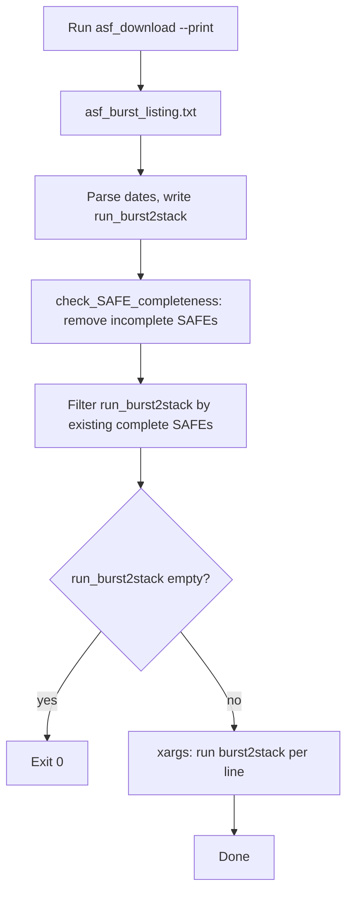

# Burst Download and burst2stack (burst_download.bash)

This document describes the architecture of `burst_download.bash`: per-date ASF burst discovery, burst2stack command generation, and SLURM-restart-safe execution. See also [docs/README_burst_download.md](../docs/README_burst_download.md) for the burst2safe path and grouping rules.

## Purpose

- Run ASF burst listing to discover available dates.
- Write one burst2stack command per date and run them in parallel via xargs.
- When run as a SLURM job with auto-restart on timeout: skip dates that already have complete `.SAFE` directories; remove incomplete SAFEs so interrupted dates are re-run.

## Script and location

| Script | Location | Role |
|--------|----------|------|
| burst_download.bash | minsar/scripts/burst_download.bash | Main entry: listing → run file → filter → xargs |
| check_SAFE_completeness.py | minsar/scripts/check_SAFE_completeness.py | Remove incomplete .SAFE dirs (required files missing) |
| generate_download_command.py | minsar/scripts/generate_download_command.py | Produces download_asf_burst.sh, download_asf_burst2stack.sh, **download_burst2stack.sh** |
| download_burst2stack.sh | (generated in work dir) | Executable script running burst_download.bash with --relativeOrbit, --intersectsWith, --start-date, --end-date, --parallel, --dir |

## Prerequisites

- Run `generate_download_command.py` first so `download_asf_burst.sh` and `download_asf_burst2stack.sh` exist in the work directory.
- `asf_download.sh` and `burst2stack` on PATH (or equivalent).

## Data flow



1. **Listing:** Execute the first (--print) line from `download_asf_burst.sh` → `SLC/asf_burst_listing.txt`.
2. **Parse:** Data lines start with `YYYY-MM-DD`; use `grep -E '^[0-9]{4}-[0-9]{2}-[0-9]{2}'` and `sed -E` (portable; no grep -oP).
3. **run_burst2stack:** One line per date: `burst2stack --rel-orbit N --start-date YYYY-MM-DD --end-date YYYY-MM-DD+1d --extent W S E N --keep-files --all-anns`. Rel-orbit and extent parsed from `download_asf_burst2stack.sh`.
4. **4a – Incomplete SAFEs:** Run `check_SAFE_completeness.py "$slc_dir"`. Removes `.SAFE` dirs missing required paths (e.g. `preview/map-overlay.kml`), logs to `SLC/DATES_REMOVED.txt`. Handles timeout mid-write on SLURM restart.
5. **4b – Filter:** For each remaining `*.SAFE` in `$slc_dir`, extract date from name (`S1A_IW_SLC__1SDV_YYYYMMDDTHHMMSS_...` → `YYYY-MM-DD`) and remove lines with `--start-date YYYY-MM-DD ` from run_burst2stack. If file empty, exit 0.
6. **Run:** `xargs -P "$num_parallel" -I {} bash -c 'cd SLC && {}' < run_burst2stack`. Parallelism = max(1, parallel / max_bursts_per_date).
7. **Post-run verification and retry (Option A):** Compare expected dates (from run_burst2stack) vs actual complete SAFEs. Write `burst2stack_failures.txt` (one line per failed date: `YYYY-MM-DD  reason`), write `run_burst2stack_rerun` with burst2stack commands for failed dates. If non-empty: one retry pass via xargs, then re-verify and rebuild failures/rerun files. If any still fail: print message and manual rerun command.

## asf_burst_listing.txt format

- Header and preamble lines (timestamp, "Found N results", etc.).
- Data lines: start with `YYYY-MM-DDTHH:MM:SSZ`; comma-separated; burst column may contain commas, so use line-start regex for dates, not CSV.

## CLI

```
burst_download.bash [--relativeOrbit N] [--intersectsWith POL] [--start-date DATE] [--end-date DATE] \
  [--work-dir DIR] [--slc-dir DIR | --dir DIR] [--parallel N] [--skip-listing] [--help]
```

### Options and defaults

| Option | Default | Notes |
|--------|---------|-------|
| --relativeOrbit | (from script) | Required for standalone mode |
| --intersectsWith | (from script) | AOI polygon; required for standalone mode |
| --start-date | 2000-01-01 | YYYY-MM-DD |
| --end-date | 2099-12-31 | YYYY-MM-DD |
| --work-dir | . | Work directory |
| --slc-dir / --dir | SLC | SLC output directory |
| --parallel | 20 | Max parallel burst2stack jobs |
| --skip-listing | off | Use existing asf_burst_listing.txt |

**Template mode:** Use `download_asf_burst.sh` and `download_asf_burst2stack.sh` (from generate_download_command.py). **Standalone mode:** Pass both `--relativeOrbit` and `--intersectsWith`; no generated scripts needed.

## Example: how to run

**1. Create the work directory and generate download scripts** (once per project):

```bash
cd $SCRATCHDIR/MyProject
generate_download_command.py $TE/MyTemplate.template --delta-lat 0.0 --delta-lon 0.0
```

This creates `download_asf_burst.sh`, `download_asf_burst2stack.sh`, and **download_burst2stack.sh** in the current directory.

**2. Run burst_download.bash:**

Template mode (uses download_asf_burst.sh and download_asf_burst2stack.sh):

```bash
$MINSAR_HOME/minsar/scripts/burst_download.bash --work-dir $SCRATCHDIR/MyProject --parallel 4
```

Standalone mode (use generated **download_burst2stack.sh** or pass options):

```bash
# After generate_download_command, run:  ./download_burst2stack.sh
# Or invoke manually:
$MINSAR_HOME/minsar/scripts/burst_download.bash --relativeOrbit 36 --intersectsWith='Polygon((25.32 36.33, 25.49 36.33, 25.49 36.49, 25.32 36.49, 25.32 36.33))' --start-date 2014-10-01 --end-date 2015-12-31 --parallel 20 --dir SLC
```

Restart (skip re-fetching listing):

```bash
$MINSAR_HOME/minsar/scripts/burst_download.bash --work-dir $SCRATCHDIR/MyProject --skip-listing --parallel 4
```

**3. Optional: run as a SLURM job** (e.g. skx-dev, auto-restart on timeout):

```bash
cd $SCRATCHDIR/MyProject
sbatch --partition=skx-dev --time=02:00:00 --wrap="bash $MINSAR_HOME/minsar/scripts/burst_download.bash --work-dir $PWD --parallel 4"
```

- `--work-dir`: directory containing download_asf_burst.sh and download_asf_burst2stack.sh (default: `.`).
- `--slc-dir`: SLC directory (default: `SLC`).
- `--parallel`: max parallel burst2stack jobs (default: 20).
- `--skip-listing`: use existing asf_burst_listing.txt; do not run asf_download --print.

## SLURM restart (e.g. skx-dev, auto-restart on timeout)

- **Goal:** On restart, do not re-run burst2stack for dates that already have complete `.SAFE` directories.
- **Edge case:** On timeout, burst2stack may be mid-write, leaving an incomplete `.SAFE`. Step 4a removes incomplete SAFEs so that date is re-run on restart.
- **Order:** Write run_burst2stack → check_SAFE_completeness.py → filter by existing complete SAFEs → xargs.
- **Optional:** SLURM job wrapper with #SBATCH for skx-dev, walltime; call burst_download.bash with --work-dir, --parallel.

## Failure and rerun output files (under $slc_dir)

| File | Purpose |
|------|---------|
| burst2stack_failures.txt | One line per failed date: `YYYY-MM-DD  reason` (e.g. "no SAFE produced", "no SAFE produced (retry)") |
| run_burst2stack_rerun | Burst2stack commands for failed dates; same format as run_burst2stack; use for manual rerun |

The script runs one retry pass automatically. To rerun manually:
```bash
xargs -P N -I {} bash -c 'cd SLC && {}' < SLC/run_burst2stack_rerun
```

## burst2stack options

- `--extent`: bounds as W S E N (lon_min, lat_min, lon_max, lat_max). From polygon `Polygon((25.32 36.33, 25.49 36.33, 25.49 36.49, 25.32 36.49, 25.32 36.33))` → extent `25.32 36.33 25.49 36.49`.
- Per date: `--start-date YYYY-MM-DD --end-date YYYY-MM-DD` (end = start + 1 day).
- Other: `--rel-orbit`, `--pols`, `--swaths`, `--mode`, `--min-bursts`, `--all-anns`, `--keep-files`.

## Related docs

- [docs/README_burst_download.md](../docs/README_burst_download.md) – burst2safe grouping, check_burst2safe_job_outputs.py, burst_download.bash usage.
- [FILE_STRUCTURE.md](FILE_STRUCTURE.md) – Script locations.
