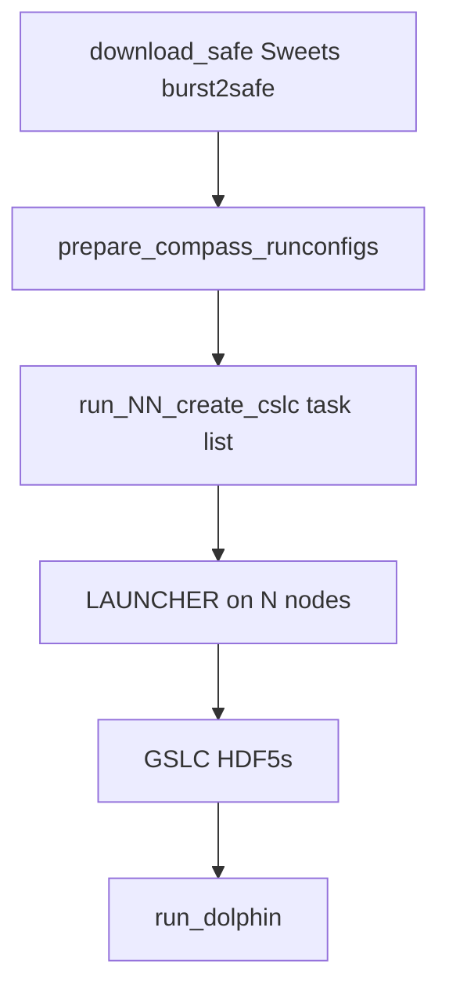
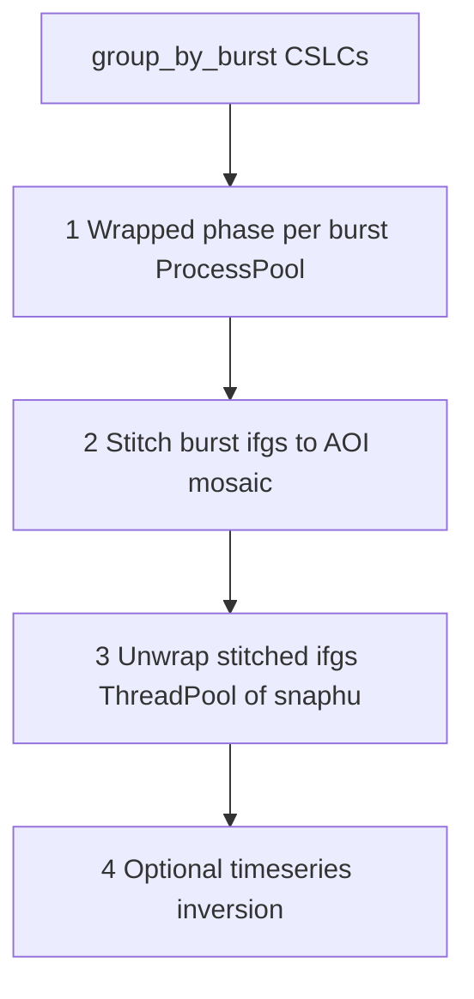

# ISCE3 HPC opportunities

Background and decision map for parallelization and walltime reduction in MinSAR’s ISCE3 workflows (`create_isce3_runfiles.py`, `run_isce3_workflow.bash`, Sweets/COMPASS/dolphin, OPERA DISP consumer path).

Implementation is split into separate opportunity plans (tackle one after another). This document does not change code by itself.

Related: [ISCE3_WORKFLOW_GENERATOR.md](./ISCE3_WORKFLOW_GENERATOR.md), [minsar/defaults/queues.cfg](../minsar/defaults/queues.cfg), [minsar/defaults/job_defaults_isce3.cfg](../minsar/defaults/job_defaults_isce3.cfg).

---

## 1. Problem

SAFE/CSLC→dolphin jobs often under-use Stampede nodes (for example 96 cores idle while one `snaphu` process runs) or hit **skx-dev** maximum walltime (**02:00:00**). Operators need a clear map of **which parallelism type** applies to **which stage**, and what stock dolphin, COMPASS, and OPERA DISP allow.

---

## 2. Types of parallelization / walltime shortening

Keep these types distinct when planning work:

| Type | Meaning | Fits which stage |
|------|---------|------------------|
| **A. Embarrassingly parallel taskfile + LAUNCHER multi-node** | Independent shell lines → `LAUNCHER_NHOSTS=N`, up to ~16×48 cores on `skx` | SAFE **`create_cslc`** (COMPASS `s1_cslc.py` per date×burst) |
| **B. Single-node multicore (Process/Thread pool)** | One process tree fills one node | Dolphin phase linking (`n_parallel_bursts`), unwrap (`n_parallel_jobs`), snaphu tiles |
| **C. Temporal stage split** | Separate SLURM jobs so each fits queue max walltime / different queues | Split dolphin: wrapped → stitch → unwrap → timeseries |
| **D. GPU acceleration** | CUDA for compute kernels; does not replace CPU unwrap | COMPASS (`isce3-cuda`), dolphin phase linking / timeseries (JAX); **not** snaphu |
| **E. Algorithmic / product-pattern change** | OPERA-DISP-style temporal ministacks → many `.nc` → reformat/rebase | Local “produce like OPERA” path; different from MinSAR DISP **consumer** download |
| **F. Queue/resource correctness** | `queues.cfg` via `JOB_SUBMIT`: CPUs, MEM, MAX_WALLTIME, MAX_NODES_PJ | Prerequisite for A–D job headers |

### Cross-cutting constraints

- Dolphin has **no MPI / multi-node**; shared-memory only (`ProcessPoolExecutor` / `ThreadPoolExecutor`).
- Default dolphin **unwraps after stitch** (AOI mosaic), not end-to-end per burst.
- Stock dolphin does **not** emit a snaphu LAUNCHER taskfile → type **A** unwrap needs custom MinSAR tooling.
- **skx-dev**: `MAX_WALLTIME=02:00:00`, limited `MAX_NODES_PJ`; production multi-node CSLC → **skx** (or similar).
- Resubmit finishes remaining work when outputs are **skipped if present** (COMPASS notebook pattern; dolphin unwrap skip-if-exists).

Execution modes in `job_defaults_isce3.cfg`: **sequential**, **single-multicore**, **launcher-task-list**.

---

## 3. Workflow stages: where cores and nodes help

| Workflow | Step | Mode today | 1-node many cores? | Multi-node LAUNCHER? |
|----------|------|------------|--------------------|----------------------|
| SAFE | `download_safe` | sequential | Weak (I/O) | No |
| SAFE | `create_cslc` | launcher-task-list | Yes (many independent `s1_cslc.py` lines) | **Yes — primary type-A target** |
| SAFE/CSLC | `run_dolphin` | single-multicore | **Yes** (ProcessPool/ThreadPool on one host) | **No** (stock dolphin) |
| CSLC | `download_cslc` | sequential | Weak | No |
| DISP | `download_disp` / `reformat_disp` | sequential | Modest (download `--num-workers`) | No |
| all | `create_hdfeos5` / `ingest_insarmaps` | single-multicore / sequential | Modest / no | No |

Job headers and CSLC dolphin worker flags use `JOB_SUBMIT` / `queues.cfg` (opportunity 0). Gap remaining: `Isce3JobAdapter` still forces `number_of_nodes=1` for `create_cslc`, so the COMPASS task list is LAUNCHER-shaped but not yet multi-node (opportunity 1).

---

## 4. Sweets vs COMPASS for ~768-CPU CSLC jobs (type A)

- **Sweets** downloads SAFEs and later runs dolphin (`sweets run --starting-step 3`). A single `sweets run` geocode process does **not** fill 16 nodes.
- **COMPASS** does local GSLC creation. `prepare_compass_runconfigs.py` writes a **long task file**: one `s1_cslc.py <runconfig>` per date×burst (+ static layers). Same grain as `tools/isceplus/2.1_ISCE3_TOPS_Processing/S1_GSLC_burst_stack.ipynb` (skip if HDF5 exists).
- With `launcher_multiTask_multiNode` + `JOB_SUBMIT` / `queues.cfg` `MAX_NODES_PJ`, **`create_cslc` can use ~16 nodes × 48 cores** on `skx`.

---

## 5. Dolphin: MPI, unwrap, temporal and spatial separation

Source: `dolphin/workflows/displacement.py`, `unwrap/_unwrap.py` (sweets pixi env).

### 5.1 Shared-memory only (type B)

| Stage | Mechanism | Knob |
|-------|-----------|------|
| Per-burst phase linking | `ProcessPoolExecutor` | `n_parallel_bursts` |
| Threads / JAX inside a burst | OMP / JAX | `threads_per_worker` |
| Many ifgs unwrap | `ThreadPoolExecutor` → snaphu | `n_parallel_jobs` |
| One large ifg | SNAPHU tiling | `ntiles`, `n_parallel_tiles` |

Multi-node `#SBATCH -N 16` with one `dolphin run` does not distribute work across nodes.

### 5.2 Temporal separation (type C)

Internally dolphin is four stages; MinSAR exposes one `run_dolphin` SLURM step and one CLI (`dolphin run`).

| Boundary | What must finish first | What can wait | How to stop / resume today |
|----------|------------------------|---------------|----------------------------|
| After wrapped phase (per burst) | Burst ifgs + quality under each burst dir | Stitch, unwrap, timeseries | Not first-class CLI; needs custom configs/hooks |
| After stitch | Mosaic ifgs/cor/temp_coh | Unwrap + timeseries | `unwrap_options.run_unwrap: false`, then later job with unwrap on |
| After unwrap | Unw + conncomp rasters | Timeseries | Turn off `run_inversion` / `run_velocity` |
| Mid-unwrap | Completed ifg unwrap files | Remaining ifgs | Skip if output exists; in-flight snaphu may need cleanup |

Why it matters on Stampede: skx-dev 2h often finishes linking+stitch but dies in unwrap. Ideal MinSAR layout:

1. Job A — wrapped + stitch (`run_unwrap: false`) on short/dev queue  
2. Job B — unwrap-only (dolphin unwrap config or LAUNCHER per-ifg) on longer queue  
3. Job C — timeseries + hdfeos5  

Sweets `--starting-step 3` only skips download/geocode; it does **not** split dolphin internally.

### 5.3 Spatial separation

| Approach | Works with stock dolphin? | Notes |
|----------|---------------------------|-------|
| Parallel bursts for phase linking | Yes | Cap ≈ number of bursts |
| End-to-end product per burst (no stitch) | No (default) | Unwrap/timeseries expect stitched stack |
| Wrapped-only per burst, stitch later | Possible with custom tooling | Extra MinSAR design |
| SNAPHU spatial tiles inside one ifg | Yes | `ntiles` / `n_parallel_tiles` |
| Azimuth blocks as synthetic bursts | Upstream (e.g. NISAR) | Still one-node ProcessPool |

### 5.4 Snaphu options vs 16-node / ~768-core LAUNCHER

**Generally available:**

1. **Many 1-core (or few-core) snaphu jobs, one per interferogram** — classic topsStack/miaplpy LAUNCHER pattern across 16×48 cores.
2. **SNAPHU tiled unwrap of one large ifg** — `ntiles`, `n_parallel_tiles` inside one process.
3. **Hybrid** — LAUNCHER distributes ifgs; each ifg may use modest tiling.

**What dolphin exposes today:** (1)-like concurrency only as an in-process ThreadPool on **one node**; (2) via snaphu options. **Not** a MinSAR taskfile of snaphu CLI lines.

**Why 768-core LAUNCHER unwrap is hard with current dolphin:** no task-list export; no MPI; unwrap coupled after stitch inside `DisplacementWorkflow.run`; snaphu-py is embedded library calls, not LAUNCHER shell lines; multi-node scratch/`LAUNCHER_PPN` never configured by dolphin.

Practical path for type-A unwrap: MinSAR post-stitch step that lists stitched ifgs and writes LAUNCHER tasks (miaplpy-style). Until then, fill **one** high-core node (e.g. pvc 96) with `n_parallel_jobs` + optional tiles.

---

## 6. CUDA GPUs (type D)

| Step | GPU? | Mechanism | Rough speedup vs CPU | Notes |
|------|------|-----------|----------------------|-------|
| COMPASS `create_cslc` | Yes | sweets pixi **gpu** env / `isce3-cuda` | Often large, scene-dependent | GPU queues (e.g. h100, amd-rtx) |
| Dolphin phase linking | Yes | JAX+CUDA (`gpu_enabled`) | Docs ~5–20×; maintainers also cite ~3–5× | Often under-utilized; multiple bursts help |
| Dolphin timeseries inversion | Yes (JAX) | Same stack | ~5–10× on large stacks (anecdotal) | After unwrap |
| Dolphin unwrap (snaphu) | **No** | CPU SNAPHU | ~1× | Often slowest full-workflow step |
| Downloads / stitch I/O / hdfeos5 / ingest | No | I/O / CPU | Negligible | |

GPU accelerates CSLC geocode and phase linking; it does **not** remove the CPU unwrap bottleneck.

---

## 7. OPERA DISP: consumer jobs vs sequential processor (type E)

### MinSAR `--disp-S1` (consumer)

One frame → four sequential jobs: `download_disp` → `reformat_disp` → `create_hdfeos5` → `ingest`. Little HPC fan-out (download `--num-workers` only). This is **not** the OPERA production SAS.

### Upstream sequential / StBAS (`tools/disp-s1`, dolphin `sequential.py`)

- “Sequential” means **temporal ministacks in a chain** (carry compressed CSLCs forward). Walltime ≈ sum of ministack runtimes.
- Parallel unit inside a batch = **bursts** (`n_parallel_bursts`), **not** MiaplPy-style spatial patches.
- Product pattern: many moving-reference `OPERA*.nc` → `opera-utils disp-s1-reformat` / rebase → continuous timeseries.

### “Process one patch after another?”

- If **patch** = **spatial tile**: that is **not** the OPERA DISP sequential model in this repo.
- If **patch** = **temporal ministack**: yes—that is StBAS; it **serializes** walltime along the stack but bounds memory/history and enables forward processing. Burst parallelism still shortens each ministack.

### Pursue OPERA-disp-type optimization for local dolphin?

Worth a dedicated spike: ministack batches → per-batch products → reformat, vs one monolithic `dolphin run`. Tradeoffs: more jobs and bookkeeping vs better resume granularity and OPERA-compatible intermediates. Does **not** by itself provide 16-node unwrap.

---

## 8. Timeouts and resubmit

`run_isce3_workflow.bash` (like `run_workflow.bash`):

- **TIMEOUT**: bump walltime via `update_walltime_queuename.py` (queues.cfg `MAX_WALLTIME` / `QUEUE_AT_MAX_WALLTIME`), resubmit.
- **FAILED**: exit (no auto-retry of failed logic).

| Stage | If killed mid-job | Resubmit finishes remaining? |
|-------|-------------------|------------------------------|
| Downloads | Partial files on disk | Often yes via check/delete/redownload helpers |
| `create_cslc` | Completed burst HDF5s remain | Yes if tasks skip existing outputs |
| `run_dolphin` | Partial `dolphin/` tree | Partial; mid-snaphu may need cleanup of that ifg |
| hdfeos5 / ingest | Usually all-or-nothing | Rerun whole step |

---

## 9. Opportunity plans (ordered)

Tackle **one plan at a time**:

| Order | Plan | Types | Why this order |
|-------|------|-------|----------------|
| 0 | [plans/00_job_resources_foundation.md](./plans/00_job_resources_foundation.md) | F (+ B dolphin worker defaults) | Correct `#SBATCH` from `queues.cfg` via `JOB_SUBMIT`; unblocks multi-node |
| 1 | [plans/01_cslc_launcher.md](./plans/01_cslc_launcher.md) | A (+ skip-existing) | Largest clear win; task list already exists |
| 2 | [plans/02_dolphin_stage_split.md](./plans/02_dolphin_stage_split.md) | C | Fits 2h queues; isolates unwrap walltime |
| 3 | [plans/03_unwrap_scaleout.md](./plans/03_unwrap_scaleout.md) | A after stitch, or B on fat node | Hardest; design after split |
| 4 | [plans/04_gpu_path.md](./plans/04_gpu_path.md) | D | Independent; queue + pixi `gpu` env |
| 5 | [plans/05_opera_disp_style.md](./plans/05_opera_disp_style.md) | E (spike) | Strategic; validate before building |

Index: [plans/README.md](./plans/README.md).

### Explore later (checklist, not separate plans yet)

- Burst-count-aware dolphin worker auto-tune on 1 node (CSLC `run_dolphin` counts OPERA burst IDs at run time).
- Multi-frame DISP download fan-out (only if users run many frames).
- Whether COMPASS static-layers should be a separate short job after CSLC.
- Hybrid schedule: GPU node for linking → CPU multi-node LAUNCHER for unwrap (plans 3+4).

---

## 10. Non-goals of this document

- No code changes beyond maintaining this Architecture note and its README link.
- No change to `queues.cfg` numeric limits without a dedicated ops decision.
