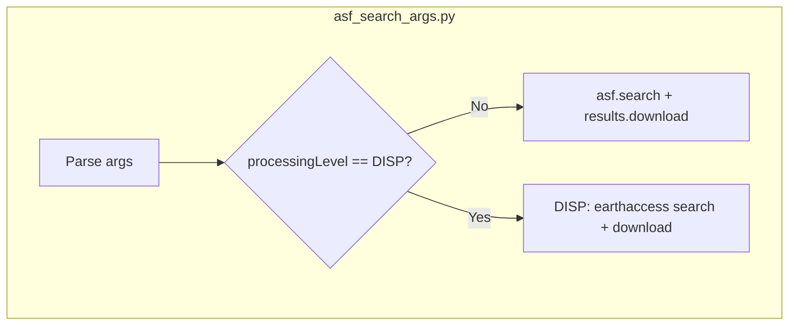

# Plan: Add OPERA Displacement to asf_search_args.py

**Target file:** [minsar/src/minsar/cli/asf_search_args.py](minsar/src/minsar/cli/asf_search_args.py)

**Reference implementation:** [minsar/scripts/download_opera_displacement.py](minsar/scripts/download_opera_displacement.py)

---

## For AI agents implementing future changes

- **Initial phase:** Use both `asf_search_args.py` and `download_opera_displacement.py` during implementation and verification.
- **After verification:** Once OPERA DISP support in `asf_search_args.py` is confirmed working, [minsar/scripts/download_opera_displacement.py](minsar/scripts/download_opera_displacement.py) is **obsolete** and can be removed. No need to maintain both scripts long term.

---

## OPERA DISP product documentation

- **ASF Displacement Portal:** https://displacement.asf.alaska.edu/
- **ASF Displacement docs:** https://docs.asf.alaska.edu/vertex/displacement
- **OPERA DISP FAQ:** https://docs.asf.alaska.edu/datasets/disp_faq
- **NASA Earthdata catalog (OPERA_L3_DISP-S1_V1):** https://www.earthdata.nasa.gov/data/catalog/asf-opera-l3-disp-s1-v1-1
- **JPL OPERA DISP Product Specification:** https://www.jpl.nasa.gov/go/opera/products/disp-product-suite
- **AWS Open Data Registry:** https://registry.opendata.aws/nasa-operal3disp-s1v1/
- **MAAP: Access and visualize OPERA DISP (earthaccess examples):** https://docs.maap-project.org/en/latest/science/OPERA/OPERA_Surface_Displacement.html

---

## Why earthaccess (not asf_search)

OPERA_L3_DISP-S1_V1 is not in the ASF Search API. It is in NASA CMR and must be accessed via **earthaccess**. `asf.search()` cannot return OPERA DISP granules.

---

## Current download_opera_displacement.py behavior (reference)

- **CLI:** positional `polygon` (WKT), `--dir`, `--print`, `--download` (default)
- **Search:** `earthaccess.search_data(short_name='OPERA_L3_DISP-S1_V1', bounding_box=bbox, temporal=('2016-07-01', today))`
- **Polygon:** parsed to bbox (min_lon, min_lat, max_lon, max_lat) via `parse_polygon()`
- **Credentials:** `_load_password_config()` from password_config (asfuser/asfpass), same locations as asf_search_args
- **Download:** `earthaccess.download(results, args.dir)`

---

## Implementation: asf_search_args.py changes

### 1. Add DISP to processing level

- Extend `--processingLevel` choices: add `'DISP'`
- When `processing_level == 'DISP'`, set `inps.processing_level = 'DISP'` (no asf constant; DISP is handled separately)

### 2. DISP-specific branch before asf.search()

If `inps.processing_level == 'DISP'`:

1. **Require `--intersectsWith`** (polygon). Exit with error if missing.
2. **Parse polygon to bbox** – reuse logic from download_opera_displacement (inline or shared).
3. **Load credentials** – use `_load_password_config()` pattern from download_opera_displacement.
4. **earthaccess flow:**
   - `import earthaccess` (handle ImportError with install hint)
   - `earthaccess.login()`
   - `results = earthaccess.search_data(short_name='OPERA_L3_DISP-S1_V1', bounding_box=bbox, temporal=('2016-07-01', date.today().isoformat()))`
5. **Print** – if `inps.print`: list granule_ids (same format as download_opera_displacement).
6. **Download** – if `inps.download`: `earthaccess.download(results, inps.dir)`.

Do not call `asf.search()` for DISP. Skip platform/dataset/polarization setup for DISP.

### 3. Shared utilities

- Add `parse_polygon(polygon_str) -> (min_lon, min_lat, max_lon, max_lat)` – same logic as download_opera_displacement.
- Add `_load_password_config()` – same search paths (SSARAHOME, minsar/utils/ssara_ASF, tools/ssara_client).

### 4. Dependencies

Add `earthaccess` to `pip_requirements.txt` and `minsar_env.yml` (or equivalent).

### 5. Examples in epilog

```
OPERA displacement (DISP):
    asf_search_args.py --processingLevel=DISP --intersectsWith='POLYGON((...))' --print
    asf_search_args.py --processingLevel=DISP --intersectsWith='POLYGON((...))' --download --dir=./opera_disp
```

---

## Verification

1. Run `asf_search_args.py --processingLevel=DISP --intersectsWith='POLYGON((-86.6 12.38,-86.45 12.38,-86.45 12.49,-86.6 12.49,-86.6 12.38))' --print` – should list granules.
2. Run same with `--download --dir=./test_disp` – should download.
3. Compare results with `download_opera_displacement.py "POLYGON(...)" --print` and `--download --dir ./test_disp2` – granule lists and downloads should match.
4. Once verified, `download_opera_displacement.py` can be removed.

---

## Architecture diagram


