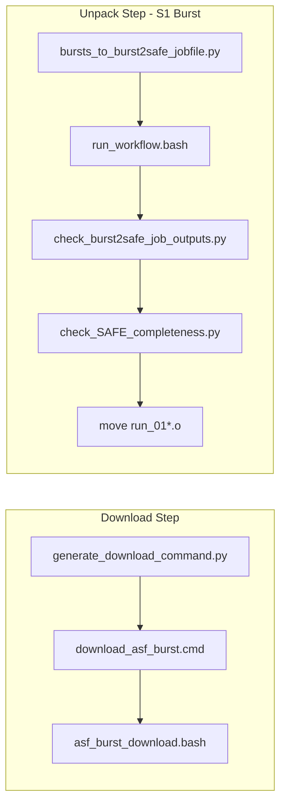

# Download and Unpack Architecture

This document describes the **download** and **unpack** steps in MinSAR.

## Download Step

Controlled by `download_method` in `minsarApp.bash`. All methods (except `remote_data_dir`) are preceded by:

```bash
generate_download_command.py $template_file --delta-lat 0.0 --delta-lon 0.0
```

which generates the appropriate `.cmd` files in the project directory.

### Download Methods and Invocation Pattern

All download methods use the same pattern: **cd** to `$download_dir`, run a command from a `.cmd` file, **cd** back.

| Method | .cmd file | Script invoked | Notes |
|--------|-----------|----------------|-------|
| `ssara-bash` | `download_ssara_bash.cmd` | `ssara_federated_query.bash` | Default for TSX, CSK, Envisat |
| `ssara-python` | `download_ssara_python.cmd` | `ssara_federated_query.py` | |
| **`asf-burst`** | **`download_asf_burst.cmd`** | **`asf_burst_download.bash`** | Sentinel-1 bursts only |
| `asf-slc` | N/A (script) | `download_asf.sh` | ASF SLC products |
| `remote_data_dir` | N/A | `rsync` | From template `minsar.remoteDataDir` |

**Invocation in minsarApp.bash** (same pattern for ssara-bash and asf-burst):

```bash
cd $download_dir
cmd=$(sed -n '1p' ../download_asf_burst.cmd)   # or: cmd=$(cat ../download_ssara_bash.cmd)
run_command "$cmd"
cd ..
```

### download_asf_burst.cmd Format

Generated by `generate_download_command.py`. Three lines:

```
asf_burst_download.bash                                    # Line 1: invocation (run by minsarApp)
asf_download.sh --processingLevel=BURST ... --dir=. --print >asf_burst_listing.txt   # Line 2: listing
asf_download.sh --processingLevel=BURST ... --dir=. --download                       # Line 3: download
```

- **Line 1** is what minsarApp.bash executes (via `sed -n '1p'`).
- **Lines 2-3** are read by `asf_burst_download.bash` itself.
- All paths use `--dir=.` because cwd is the SLC directory.

### asf_burst_download.bash Flow

Runs from `$download_dir` (SLC). Reads `../download_asf_burst.cmd`:

1. **Listing:** Runs line 2 once to create `asf_burst_listing.txt`.
2. **Download retry loop:** Runs line 3 repeatedly (default: 1 hour, configurable to 12 hours). After each attempt checks that `*BURST.tiff` count matches the listing. Exits loop on success or timeout.
3. **Size check:** After success, any burst file below 100 MB triggers removal of all files for that date. Removed dates are appended to `DATES_REMOVED.txt` in cwd.

## Unpack Step

### Non-Sentinel-1

```bash
unpack_SLCs.py $download_dir --queue $QUEUENAME
```

### Sentinel-1 Burst (asf-burst)

When `platform_str` contains SENTINEL-1 and `download_method == "asf-burst"`:

1. `bursts_to_burst2safe_jobfile.py SLC` -- creates `SLC/run_01_burst2safe` and `.job` files
2. `run_workflow.bash --jobfile $WORK_DIR/SLC/run_01_burst2safe --no-check-job-outputs`
3. `check_burst2safe_job_outputs.py SLC` -- validates outputs, creates rerun file if needed
4. If `SLC/run_01_burst2safe_rerun_0` non-empty: `rerun_burst2safe.sh SLC/run_01_burst2safe_rerun_0.job`
5. `check_SAFE_completeness.py SLC` -- removes incomplete SAFEs (e.g. missing `preview/map-overlay.kml`)
6. Move `SLC/run_01*.o` into `SLC/stdout_run_01_burst2safe/`



## DATES_REMOVED.txt

Any step that removes a date appends to `SLC/DATES_REMOVED.txt`. Format:

```
YYYYMMDD  <short reason>
```

Examples:

- `20170116  Burst file below size threshold (100 MB)`
- `20170116  SAFE incomplete: preview/map-overlay.kml missing`

## Key Files

| File | Purpose |
|------|---------|
| `minsar/bin/minsarApp.bash` | Orchestrates download and unpack steps |
| `minsar/scripts/generate_download_command.py` | Writes `.cmd` files including `download_asf_burst.cmd` |
| `minsar/bin/asf_burst_download.bash` | Burst download: listing, retry loop, size check |
| `minsar/scripts/check_SAFE_completeness.py` | Check SAFE dirs for required files, remove incomplete |
| `minsar/scripts/bursts_to_burst2safe_jobfile.py` | Creates `run_01_burst2safe` and `.job` files |
| `minsar/scripts/check_burst2safe_job_outputs.py` | Validates burst2safe outputs, writes rerun list |
