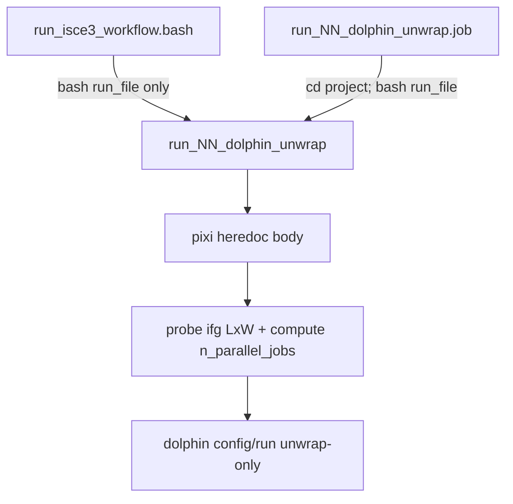

# ISCE3 dolphin stage split (opportunity 2)

Background: [ISCE3_HPC_opportunities.md](../ISCE3_HPC_opportunities.md) type **C**. Best after opportunity 0; enables opportunity 3.

## Goal

Replace the single `dolphin` SLURM step with sequential MinSAR stages that match dolphin’s internal pipeline boundaries, so skx-dev 2h (and queue switches) work without losing finished work.

Each stage gets its own queue/walltime profile from [job_defaults_isce3.cfg](../../minsar/defaults/job_defaults_isce3.cfg) and [queues.cfg](../../minsar/defaults/queues.cfg).

## Stage names and run/job files

Default on `create_isce3_runfiles.py` for **CSLC**: three dolphin stages. Pass **`--no-dolphin-split`** for one monolithic `dolphin` stage.

| Stage name | CSLC step | SAFE step |
|------------|-----------|-----------|
| `dolphin_wrapped` | `run_02_dolphin_wrapped` | `run_03_dolphin_wrapped` |
| `dolphin_unwrap` | `run_03_dolphin_unwrap` | `run_04_dolphin_unwrap` |
| `dolphin_timeseries` | `run_04_dolphin_timeseries` | `run_05_dolphin_timeseries` |

Each has a matching `.job` file (`run_NN_<stage>.job`). Downstream steps (`create_hdfeos5`, `ingest_insarmaps`) shift by +2 step numbers on CSLC (+3 on SAFE).

## Proposed stages

1. **Wrapped + stitch** — `unwrap_options.run_unwrap: false` (and typically no timeseries). Burst-aware linking knobs (`n_parallel_bursts`, `threads_per_worker`) from opportunity 0, baked into run files at generate time in [create_isce3_runfiles.py](../../minsar/src/minsar/cli/create_isce3_runfiles.py).
2. **Unwrap** — unwrap-only config or dedicated entry; **memory-aware** `n_parallel_jobs` (see below). Still 1-node ThreadPool until opportunity 3.
3. **Timeseries** — inversion/velocity then existing `create_hdfeos5` / ingest as today.


## Memory-aware `n_parallel_jobs` (unwrap stage)

Today [`_dolphin_worker_counts`](../../minsar/src/minsar/cli/create_isce3_runfiles.py) sets `n_parallel_jobs = cpus // 4` from CPU only. That is acceptable for small Hawaii ifgs on pvc but can OOM on skx-dev with large stitched products (e.g. Etna-scale stacks).

For the **unwrap stage** of a multi-stage run, MinSAR must:

1. **Determine interferogram size** — after stitch outputs exist, read LENGTH×WIDTH from one representative **stitched** wrapped ifg (GeoTIFF under dolphin’s stitched tree, e.g. first entry in the stitch output list). Use raster metadata (`rasterio` / gdalinfo-style probe), not burst CSLC dimensions.
2. **Estimate RAM per concurrent unwrap job** — algorithm-dependent; reuse the miaplpy snaphu baseline where applicable ([`resize_miaplpy_unwrap_jobfiles.py`](../../minsar/scripts/resize_miaplpy_unwrap_jobfiles.py), [miaplpy_unwrap_job_resize.md](../../minsar/docs/miaplpy_unwrap_job_resize.md)):

| `unwrap_method` | Per-job memory model (initial) |
|-----------------|--------------------------------|
| **snaphu** (default) | `LENGTH × WIDTH × bytes_per_pixel / num_tiles`; start with **420 B/pixel** (validated miaplpy sites); `num_tiles = ntiles[0] × ntiles[1]` from `unwrap_options.snaphu_options` |
| **icu / phass** (tophu) | Higher than single-pass snaphu (multiscale); use conservative multiplier or separate empirical factor until benchmarked |
| **spurt** | Treat as **large 3D** workload; default **`n_parallel_jobs = 1`** unless measured |
| **whirlwind** | Same as **snaphu** for now (420 B/pixel + tile settings); refine after measurement |

Also account for **intra-ifg** parallelism when set: `snaphu_options.n_parallel_tiles` caps concurrent jobs by CPU (`cpus // n_parallel_tiles`), same pattern as miaplpy `--num_tiles` / `--nproc`.

3. **Compute `n_parallel_jobs` from available node memory**:

```text
mem_per_job_MiB = estimate_unwrap_mem(length, width, unwrap_method, unwrap_options)
usable_mem_MiB  = min(job_SBATCH_mem, queues.cfg MEM_PER_NODE) - dolphin_overhead - safety_margin
mem_cap         = max(1, floor(usable_mem_MiB / mem_per_job_MiB) - startup_margin)
cpu_cap         = max(1, cpus_per_node // max(1, cores_per_unwrap_job))
n_parallel_jobs = min(mem_cap, cpu_cap)
```

- **Node memory** from [queues.cfg](../../minsar/defaults/queues.cfg) for the unwrap queue; respect SLURM `#SBATCH --mem` if lower.
- **Safety margin** — same rationale as miaplpy (`PPN_SAFETY_MARGIN`, extra margin when many snaphus start in one ThreadPool wave).
- **When to run sizing** — at the **start of the `dolphin_unwrap` run file** (inside the pixi heredoc body), when stitched ifgs already exist from `dolphin_wrapped`. **`run_isce3_workflow.bash` does not add a separate pre-step**; it keeps calling `bash run_files/run_NN_dolphin_unwrap` like any other stage (local or via SLURM job file).

### Where sizing runs (implementation)



| Layer | Role |
|-------|------|
| [`run_isce3_workflow.bash`](../../minsar/src/minsar/cli/run_isce3_workflow.bash) | Unchanged: `bash run_files/run_NN_dolphin_unwrap` (no extra probe command). |
| [`run_NN_dolphin_unwrap.job`](../../minsar/src/minsar/cli/create_isce3_runfiles.py) | Unchanged: `#SBATCH …`, `cd` project, `bash run_files/run_NN_dolphin_unwrap`, validate. |
| **`run_NN_dolphin_unwrap`** | Generated by [`create_isce3_runfiles.py`](../../minsar/src/minsar/cli/create_isce3_runfiles.py): pixi wrapper + **first commands** probe/size, then `dolphin config` / `dolphin run` with computed `--unwrap-options.n-parallel-jobs`. |

**Helper:** new [`minsar/scripts/resize_dolphin_unwrap_jobfile.py`](../../minsar/scripts/resize_dolphin_unwrap_jobfile.py) — ISCE3/dolphin counterpart to [`resize_miaplpy_unwrap_jobfiles.py`](../../minsar/scripts/resize_miaplpy_unwrap_jobfiles.py). **No changes to miaplpy or ISCE2 paths**; shared snaphu memory math lives in a small util both scripts import.

### `resize_dolphin_unwrap_jobfile.py`

| | MiaplPy `resize_miaplpy_unwrap_jobfiles.py` | Dolphin `resize_dolphin_unwrap_jobfile.py` |
|--|---------------------------------------------|------------------------------------------|
| **When** | After miaplpy load_data | Start of `dolphin_unwrap` (stitched ifgs exist) |
| **Size source** | `inputs/slcStack.h5` | `dolphin/interferograms/*.int.tif` |
| **Output knob** | `LAUNCHER_PPN` + rewrite run_05 `.job` / task lists | **`n_parallel_jobs`** (stdout for shell, or `--dry-run` summary) |
| **Jobfile** | Rewrites multi-node LAUNCHER jobs | **Does not** rewrite miaplpy files; optional read of `#SBATCH -p` from `run_*_dolphin_unwrap.job` for queue |

**CLI (v1):**

```bash
resize_dolphin_unwrap_jobfile.py /path/to/project
resize_dolphin_unwrap_jobfile.py . --queue skx-dev --dry-run
resize_dolphin_unwrap_jobfile.py . --dolphin-config dolphin_config.yaml
```

- Default: print one integer (`n_parallel_jobs`) on stdout for use in the run file.
- `--dry-run`: print the miaplpy-style summary line (queue, mem GB, ifg L×W, mem/task, `n_parallel_jobs`) without running dolphin.
- Tile count from existing `dolphin_config.yaml` / unwrap stage yaml (`snaphu_options.ntiles`, `n_parallel_tiles`) when present.

**Shared code:** extract `mem_per_task_mib`, `compute_ppn`, `load_queue_row`, constants from the miaplpy script into e.g. [`minsar/utils/unwrap_memory.py`](../../minsar/utils/unwrap_memory.py); both resize scripts import it (miaplpy behavior unchanged).

**Caller:** first command inside **`run_NN_dolphin_unwrap`** (pixi heredoc), generated by [`create_isce3_runfiles.py`](../../minsar/src/minsar/cli/create_isce3_runfiles.py):

```bash
N_UNWRAP=$(resize_dolphin_unwrap_jobfile.py .)
dolphin config … --unwrap-options.n-parallel-jobs "$N_UNWRAP" …
```

**Docs:** short note in [`minsar/docs/`](../../minsar/docs/) (e.g. `dolphin_unwrap_job_resize.md`), parallel to [`miaplpy_unwrap_job_resize.md`](../../minsar/docs/miaplpy_unwrap_job_resize.md).

**Why not call the miaplpy script?** Wrong inputs, wrong outputs, and couples ISCE3 unwrap to miaplpy directory layout.

Monolithic `dolphin` (no stage split) can adopt the same runtime sizing once stitch completes inside one job; stage split makes the probe point explicit and allows a **memory-tuned unwrap queue** separate from linking.

## Scope

- [create_isce3_runfiles.py](../../minsar/src/minsar/cli/create_isce3_runfiles.py) — stage definitions; `run_dolphin_unwrap` calls `resize_dolphin_unwrap_jobfile.py`
- [resize_dolphin_unwrap_jobfile.py](../../minsar/scripts/resize_dolphin_unwrap_jobfile.py) — new; ifg size + `n_parallel_jobs` (imports shared unwrap memory util)
- [unwrap_memory.py](../../minsar/utils/unwrap_memory.py) — shared formulas; miaplpy resize script refactored to import (no ISCE2 behavior change)
- [run_isce3_workflow.bash](../../minsar/src/minsar/cli/run_isce3_workflow.bash) — stage list; split is default for CSLC (`--no-dolphin-split` to opt out)
- [job_defaults_isce3.cfg](../../minsar/defaults/job_defaults_isce3.cfg) — per-stage walltime/memory profiles
- Validation JSON / `validate_isce3_outputs.py` hooks per stage

## Out of scope

- Multi-node LAUNCHER unwrap taskfile (opportunity 3).
- OPERA-disp ministack product pattern (opportunity 5).
- Full calibration of non-snaphu algorithm constants (document defaults; refine with benchmarks).

## Steps

1. Confirm dolphin CLI/config knobs for stop-after-stitch, unwrap-only, and timeseries-only (reuse skip-if-exists).
2. Generate separate run/job files and workflow stage list for SAFE and CSLC.
3. **Add `resize_dolphin_unwrap_jobfile.py`** + shared `unwrap_memory.py`; wire into `run_dolphin_unwrap` run file.
4. Document operator flow (parallel to miaplpy unwrap resize doc), TIMEOUT resubmit per stage, `ntiles` vs lowering `n_parallel_jobs`.
5. Smoke on a small stack; validate on a large-AOI case that skx-dev unwrap no longer OOMs at naive `cpus//4`.

## Checklist

- [x] Define MinSAR stage names and configs (`run_unwrap: false` after stitch; unwrap-only; timeseries-only)
- [x] Add `unwrap_memory.py` + `resize_dolphin_unwrap_jobfile.py`; refactor miaplpy resize to import shared math only
- [x] Wire `run_dolphin_unwrap` to call resize script; extend `create_isce3_runfiles` / `run_isce3_workflow` for split stages
- [ ] Dry-run and short AOI smoke; large-AOI check that memory cap beats `cpus//4`; confirm resume after TIMEOUT between stages
